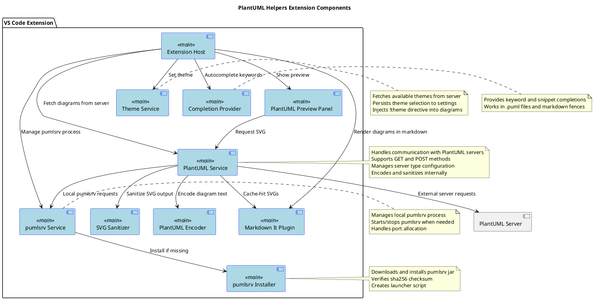
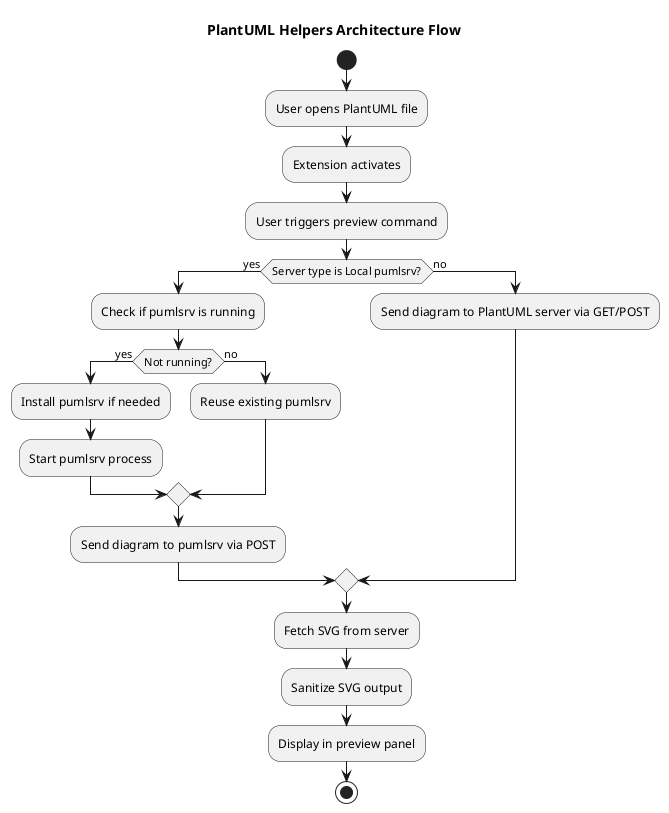
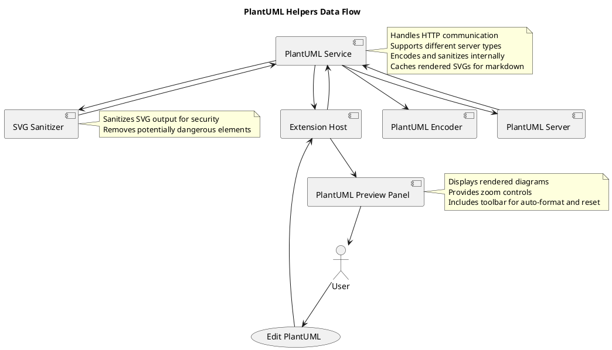
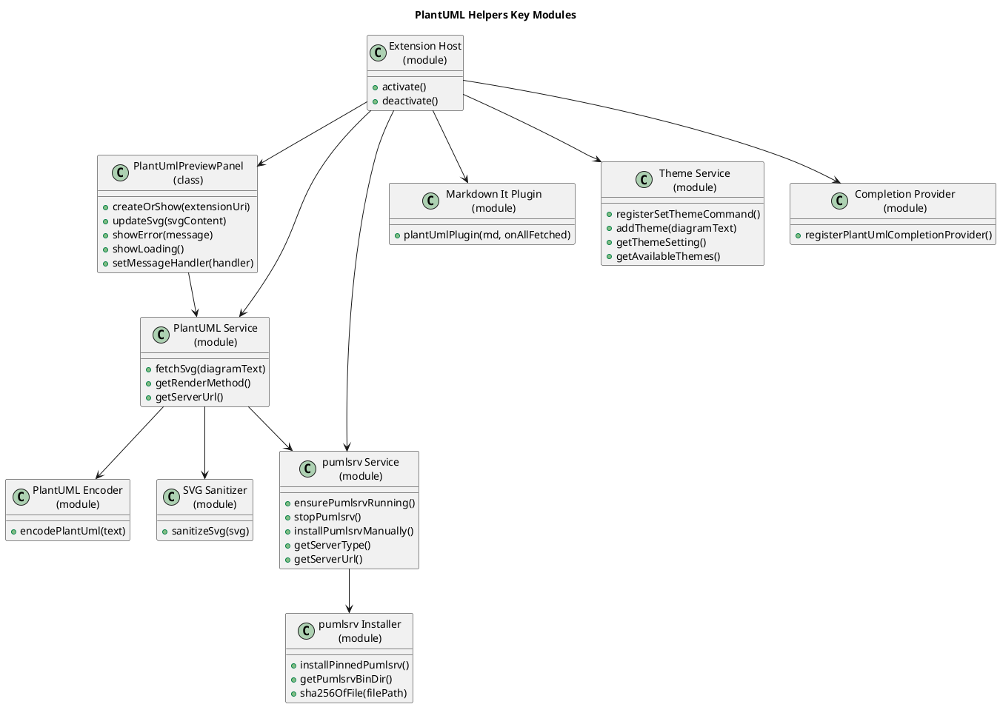
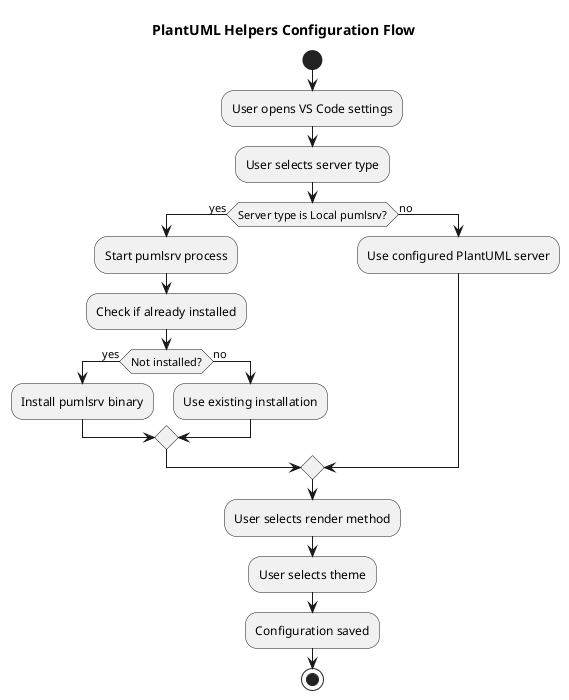

# PlantUML Helpers Architecture

This document describes the architecture of the PlantUML Helpers VS Code extension.

## Overview

The PlantUML Helpers extension provides functionality for editing and previewing PlantUML diagrams within VS Code. It supports multiple rendering backends including the public PlantUML server, a local pumlsrv instance, and custom servers.

## Component Diagram

## Architecture Flow

## Data Flow Diagram

## Key Modules

## Configuration Flow

## Extension Commands

```plantuml
@startuml
title PlantUML Helpers Extension Commands

rectangle "Swap Arrow" as swap
rectangle "Rotate Left" as rotL
rectangle "Rotate Right" as rotR
rectangle "Auto Format" as fmt
rectangle "Reset Arrows" as reset
rectangle "Show Preview" as prev
rectangle "Set Theme" as theme
rectangle "Install pumlsrv" as install

note right of swap
  Command: pumlhelper.swapLine
  Description: Swap arrow and content
end note

note right of rotL
  Command: pumlhelper.rotateLineLeft
  Description: Rotate arrow left
end note

note right of rotR
  Command: pumlhelper.rotateLineRight
  Description: Rotate arrow right
end note

note right of fmt
  Command: pumlhelper.autoFormat
  Description: Auto Format (fix arrow layout)
end note

note right of reset
  Command: pumlhelper.reFormat
  Description: Reset Arrow Directions to Defaults
end note

note right of prev
  Command: pumlhelper.showPreview
  Description: Show PlantUML Preview
end note

note right of theme
  Command: pumlhelper.setTheme
  Description: Set theme
end note

note right of install
  Command: pumlhelper.installPumlsrv
  Description: Install pumlsrv
end note
@enduml
```

