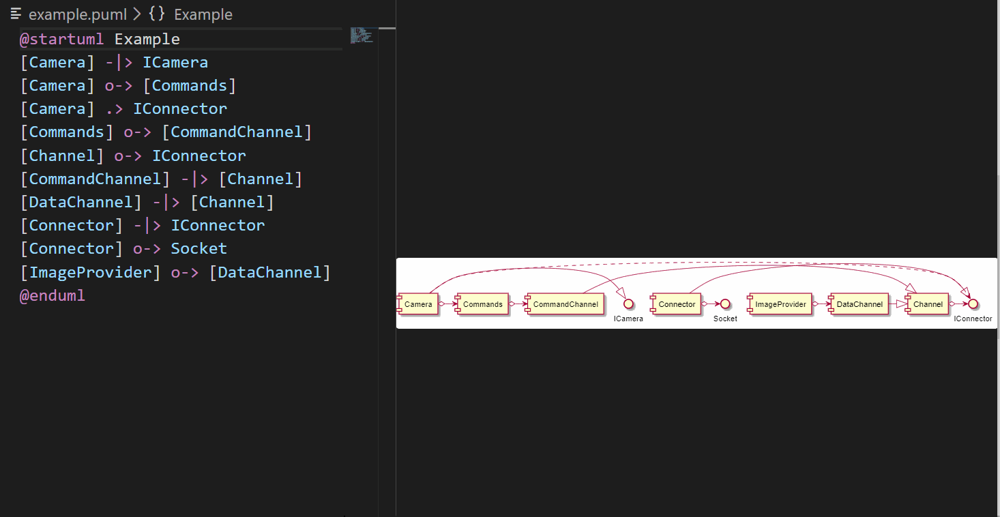

# plantuml-helpers README

This is a small helper for editing PlantUML files.

## Features

Changes the arrows in Plant-UML diagrams from horizonatal to vertical and vice versa. It can also swap the arrow direction with also swapping the content. This is helpful when changing the order in which the elements are drawn.

## Commands

The available commands are:

* PlantUMLHelpers: Auto Format UML - will try to rearrange the currently selected UML diagram according to the following rules:
    * elements with no / less incoming dependencies are moved to the beginning
    * elements with many incoming dependencies are moved to the end
    * elements are ordered by chains
    * inheritance is set to use "up" direction (if not already set to "down")
    * composition is set to use "right" direction (if not already set to "left") 

Supported diagram types are:
    * component + class diagrams
    * sequence diagrams - here the "sorting" is done by declaring the participants and actors in order

Commands with key combinations are:

* Alt-8: rotate arrow to left
* Alt-9: swap arrow left / right
* Alt-0: rotate arrow to right

**Enjoy!**
