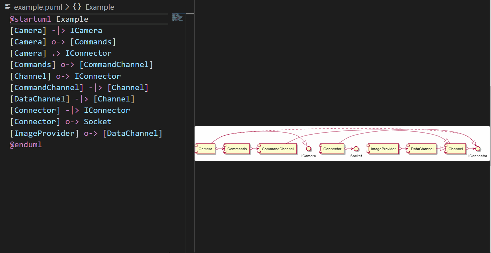

# plantuml-helpers README

This is a small helper for editing PlantUML files - as a VS Code extension and as a command line tool (`pumlfmt`).

[](https://codecov.io/gh/michael72/plantuml-helpers)



## Features

* Changes the arrows in PlantUML diagrams from horizontal to vertical and vice versa. It can also swap the arrow direction along with swapping the content. This is helpful when changing the order in which the elements are drawn.
* Auto-formats whole diagrams (see the [examples](doc/examples.md)).
* Shows a live preview of the diagram at the cursor position, rendered by a PlantUML server.
* Renders ` ```plantuml ` / ` ```puml ` code blocks inside VS Code's built-in markdown preview.
* Supports PlantUML themes and different rendering servers (public server, local [pumlsrv](https://github.com/michael72/pumlsrv) or a custom URL).
* Formatting is also available on the command line as `pumlfmt`.

## Commands

The available commands (category _PlantUMLHelpers_) are:

* _Auto Format (fix arrow layout)_ - will try to rearrange the currently selected UML diagram according to the following rules:
  * elements with no / less incoming dependencies are moved to the beginning
  * elements with many incoming dependencies are moved to the end
  * elements are ordered by chains
  * inheritance is set to use "up" direction (if not already set to "down")
  * composition is set to use "right" direction (if not already set to "left")

  Supported diagram types are:
  * component + class diagrams
  * sequence diagrams - here the "sorting" is done by declaring the participants and actors in order

* _Reset Arrow Directions to Defaults_ - similar to auto format, however directions may all be changed and directions set by the user are all overridden. Also if one source component points to several other components in the same direction the directions are automatically adjusted to point also up/down or left/right. This may already lead to good enough results.

* _Rotate arrow left_ / _Rotate arrow right_ - rotate the arrow(s) on the current line or selection by 90°.

* _Swap arrow and content_ - reverse the arrow direction and swap the elements on both sides.

* _Show PlantUML Preview_ - opens a live preview of the diagram at the cursor position in a panel beside the editor. The preview updates automatically while typing and has a toolbar with zoom controls and buttons for _Auto Format_ and _Reset Arrow Directions_.

* _Set theme_ - pick a PlantUML theme from the list of themes provided by the configured server. The theme is applied to the preview and to rendered markdown diagrams.

* _Install pumlsrv_ - downloads and installs [pumlsrv](https://github.com/michael72/pumlsrv), a lightweight local PlantUML server (see [Configuration](#configuration)).

Commands with key combinations are:

* `Alt+8`: rotate arrow left
* `Alt+9`: swap arrow and content
* `Alt+0`: rotate arrow right
* `Alt+P`: show PlantUML preview

## Markdown preview

PlantUML code blocks (` ```plantuml ` or ` ```puml `) in markdown files are rendered as diagrams directly in VS Code's built-in markdown preview, using the configured PlantUML server and theme.

## Configuration

The extension can be configured via the following settings (_PlantUML Helpers_ section):

* `plantumlHelpers.serverType` - which PlantUML server to use for rendering:
  * _PlantUML Server_ (default): the public server at plantuml.com
  * _Local pumlsrv_: a local [pumlsrv](https://github.com/michael72/pumlsrv) instance managed by the extension - the first render will prompt to install it if not present
  * _Other_: a custom server given by `plantumlHelpers.serverUrl`
* `plantumlHelpers.serverUrl` - custom PlantUML server URL (default `http://localhost:8080/plantuml`, only used when `serverType` is _Other_)
* `plantumlHelpers.renderMethod` - `get` (default) encodes the diagram in the URL, `post` sends it as plain text in the request body. When using _Local pumlsrv_, post with deflate compression is always used.
* `plantumlHelpers.theme` - the PlantUML theme used for rendering; best set with the _Set theme_ command.

## Command line interface (`pumlfmt`)

The _Auto Format_ and _Reset Arrow Directions_ commands are also available outside of
VS Code as the `pumlfmt` CLI. It works on plain PlantUML files
(`.puml`, `.plantuml`, `.iuml`, `.pu`, `.wsd`) as well as on markdown files
(`.md`, `.markdown`), where all ```` ```plantuml ````/```` ```puml ````
code blocks are formatted. Files are modified in place.

```sh
pumlfmt diagram.puml       # Auto Format (fix arrow layout)
pumlfmt --reset README.md  # Reset arrow directions to defaults
pumlfmt --check *.puml     # exit code 1 if a file would change (for CI)
```

Run `pumlfmt --help` for all options.

### Installation (Linux / macOS)

Requires Node.js >= 20. Either run the install script from a checkout:

```sh
./install.sh
```

or download and run it directly (clones the sources to `~/.local/share/pumlfmt`):

```sh
curl -fsSL https://raw.githubusercontent.com/michael72/plantuml-helpers/master/install.sh | bash
```

The script builds the CLI and places a `pumlfmt` launcher in
`/usr/local/bin` (if writable, e.g. as root in a Docker container) or
`~/.local/bin` otherwise. The target directory can be overridden with the
`BIN_DIR` environment variable, the source/build directory with `PUMLFMT_HOME`.

Alternatively `npm install -g` from a checkout also installs the `pumlfmt` binary.

## Examples

See [doc/examples.md](doc/examples.md) for before/after examples of the auto formatting.

**Enjoy!**
