## Examples

### Inheritance and Composition
Inheritance should preferably go vertical (derived up to base) while composition goes horizontal (container left, element right).

#### Unsorted original

This example shows a camera interface that - without diving into the functionality - provides access to camera functions that are sent as ASCII commands to a socket connection. There is also an image provider that receives images - also on a specific socket connection. The `Connector` is handed in to the `Camera` as `IConnector` and used to intialize the `Commands` component contained in the `Camera`. 

We start with an unsorted version.
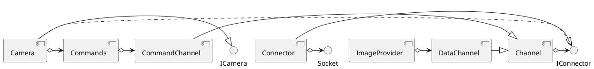

#### Sorted

Now we do execute the `PlantUML-Helpers Auto Format UML` command. This only auto formats all arrows that are aligned right. All others are left out. Initially you could also execute the `PlantUML-Helpers Reformat UML` command - which reverts *all* arrows to the defaults. The defaults are: "up" for inheritance and "right" for all others.

The first automatic formatting delivers this result:
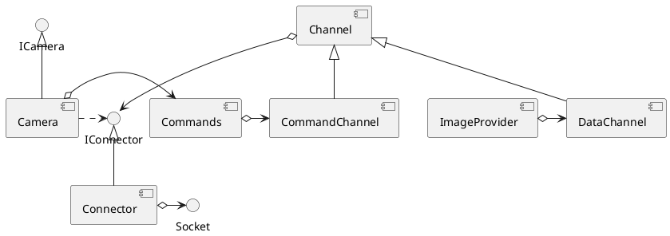

#### Swap Channel DataChannel

Already quite clean, but the `[Camera]` connection to the `[Commands]` is a bit garbled. Also the `[DataChannel]` could be moved above the `[Channel]` - inheritance should ideally be direction up, but we swap it here for a better image. We do that first.
Press "Alt-9" in the line with `[Channel] <|-- [DataChannel]` so that we get `[DataChannel] --|> [Channel]`. This only turns the arrow upside down but does not change the actual dependency direction.


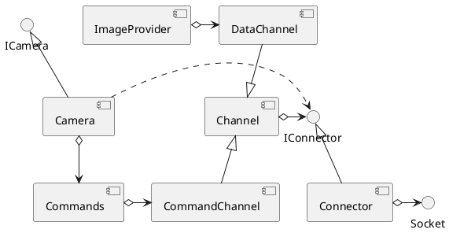

#### Swap IConnector Channel
Now the `IConnector` - `[Channel]` connection looks garbled - we turn that around (with "Alt-9") and format again, getting:

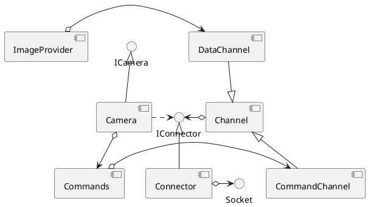

#### Final cleanup

This is almost perfect. Only the `[ImageProvider]` could be located right beside `ICamera`. We do that by adding a `-[hidden]` connection between them (with only one minus for a horizontal connection) like so: `ICamera -[hidden] [ImageProvider] ` 


Also the connection between `[Camera]` and `[Commands]` or `[Channel]` and `[CommandChannel]` could be elongated. We do that by adding `-` to `[Channel]` and `[CommandChannel]` connection - resulting in  `[Channel] <|--- [CommandChannel]` and:

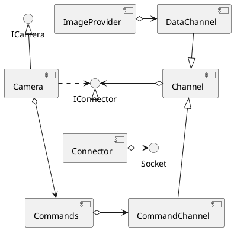
To have it perfect the connection between `IConnector` and `[Channel]` would have to be turned around, but that would lead to problems with the `[Camera]` having a *use* connection to `IConnector` and also would interfere with the layout of `[ImageProvider]`.

One lesson to (maybe) also learn here: if you have trouble drawing the dependencies of your design, it might be too complex! ;-)

#### Alternative Version

Whether you like the first auto formatted version more or think this one is cleaner is up to you. The first auto formatted version could also be formatted nicely when just elongating the line between `[Camera]` and `[Commands]`. The elongating trick often works nicely - try that!

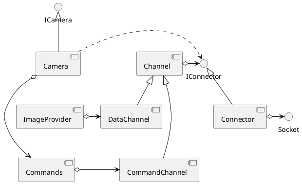

Nicely done!


### Circular dependencies

A few notes on doing circular dependencies. TODO.

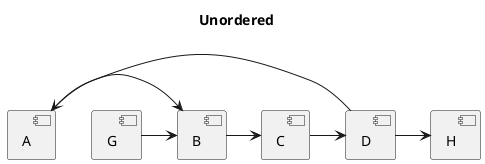

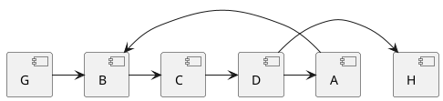

```plantuml
title Ordered - with change in direction
[G] -> [B]
[B] --> [C]
[C] -> [D]
[D] -> [H]
[A] <-- [D]
[B] <- [A]
``` 

### Simple circles
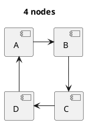
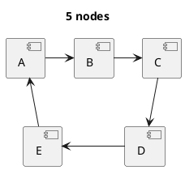
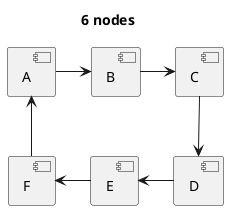
