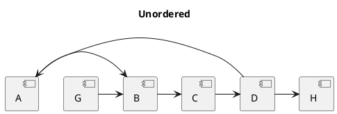
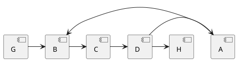
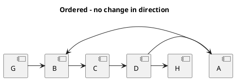
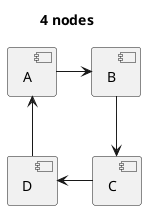
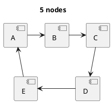
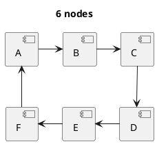
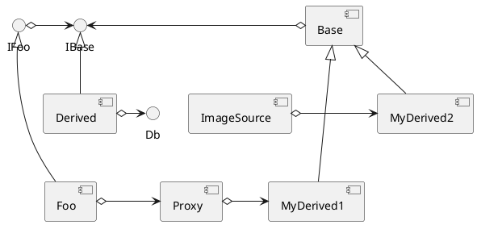

## Examples

### Circular dependencies







```plantuml
title Ordered - with change in direction
[G] -> [B]
[B] --> [C]
[C] -> [D]
[A] <-- [D]
[B] <- [A]
[D] -> [H]
``` 

### Simple circles




### Inheritance and Composition
Inheritance should preferably go vertical (derived up to base) while composition goes horizontal (container left, element right).

